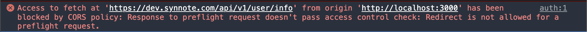
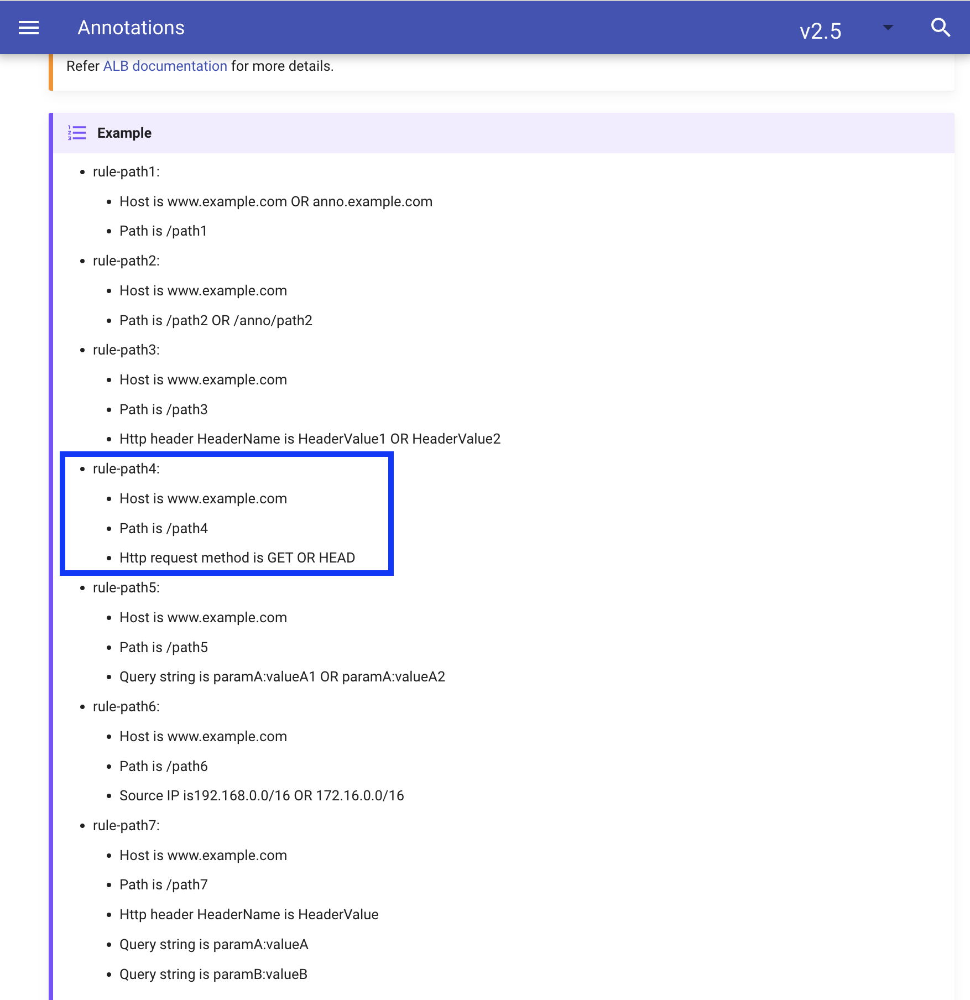

# 2023/08/03: AWS ALB(Ingress) + AWS Cognito 인증 환경에서의 CORS 문제

# 문제 정의

1. 프론트엔드 [localhost](http://localhost) 개발 환경에서 배포된 API 서버로 로그인 요청을 보내다가 CORS 이슈 발견

   

    - http://localhost:3000(프론트엔드 개발 환경 주소)에서 다른 Origin인 API 서버 도메인 [https://dev.synnote.com](https://dev.synnote.com) 으로 요청을 보내기 때문에 CORS 정책 block이 발생함

2. 같은 이슈를 웹 브라우저으로 요청 보내서 재현해봄 → CORS 이슈 없이 잘 동작하는 것을 확인

   

   

3. 강제로 CORS 이슈를 발생시키기 위하여 다른 도메인에서 웹브라우저 콘솔로 실행해봄

   

    ```jsx
    fetch('https://dev.synnote.com/api/v1/user/info', {
        method: 'GET',
        headers: {
            'Content-Type': 'application/json',
        },
    })
    .then((response) => {
        for (let [key, value] of response.headers.entries()) {
            console.log(key + ': ' + value);
        }
    
        return response.json();
    })
    .then((data) => console.log(data))
    .catch((error) => {
        console.error('Error:', error);
    });
    ```

    - 콘솔 에러 메세지를 자세히 읽어보니, Prefilight Request 응답으로 redirection이 return 되어서 block 당했다고 되어있음

# 당시 백엔드 & 인프라 구조 상황

AWS EKS 환경에서 API 서버들이 Pod로 구성되어 있는 상황이였고, Ingress로는 AWS ALB가 구성되어있어 애플리케이션을 로드밸런싱 해주고 있음.

또한 AWS ALB와 Cognito를 내장 통합하여 사용자 인증을 처리하고 있음.


Listening Rules는 아래 이미지와 같이 `/api/v1/user/info` 에서는 인증되지 않을 경우 authenticate 규칙이 적용되어 AWS Congito 구성 도메인의 Host UI로 리다이렉션한 후 자격 증명을 입력하고 인증이 되면 기존 `/api/v1/user/info` 로 리다이렉션됨.

`/api` 의 경로는 인증되지 않을 경우 deny 규칙이 적용되어 401 Authorized 에러가 떨어짐.


Springboot Cors Configuration 코드는 다음과 같음.

```kotlin
@Configuration
@EnableWebMvc
class WebMvcConfig : WebMvcConfigurer {

    override fun addCorsMappings(registry: CorsRegistry) {
        registry.addMapping("/**")
            .allowedOrigins("*")
            .allowedMethods("*")
            .allowedHeaders("*")
    }
}
```

# 문제 해결

1. 에러 로그 분석


위에서 언급했듯이 prefilight reequest의 응답으로 redirection이 return 되어서 block 당했다고 되어있음. preflight 요청은 실제 요청을 보내기 전에 웹브라우저가 보내는 요청인데, 서버가 본 요청을 처리할 수 있는지 확인하는 요청이다. 이는 HTTP 메서드중 `OPTIONS` 메서드를 사용하여 보냄으로써 CORS 정책 때문에 이 preflight 요청이 실패하면 본 요청을 전송하지 않음.

2. preflight 요청을 허용하여 서버가 정상적으로 응답하게 설정

이 문제를 해결하기 위해 Cognito와 통합되어 있는 ALB에 리스너 규칙을 추가함. 이 규칙은 preflight 요청인 경우를 판별하여 preflight 요청에 대한 인증 액션은 건너뛰고 즉, 리다이렉트를 수행하지 않도록 설정하고 백엔드 서버로 요청을 바로 전달하도록 설정함.

우선 ALB가 HTTP 요청 Method를 기반으로 라우팅 해주는 기능이 있는지 확인해봄.

[](https://ap-northeast-2.console.aws.amazon.com/ec2/home?region=ap-northeast-2#LoadBalancer:loadBalancerArn=arn:aws:elasticloadbalancing:ap-northeast-2:208967200025:loadbalancer/app/k8s-eksservergroup-cb8ffee32c/f9b99b4caee9d11d;tab=listeners)


현재 ALB는 ingress에 의해 프로비저닝 되어있음. 따라서 ingress annotation을 활용하여 ALB를 HTTP Method별로 라우팅 룰을 다르게 구성함.

아래 쿠버네티스 공식 문서를 참고함.

[Annotations - AWS Load Balancer Controller](https://kubernetes-sigs.github.io/aws-load-balancer-controller/v2.5/guide/ingress/annotations/#conditions)



`alb.ingress.kubernetes.io/conditions.${conditions-name}` 는 기존의 host/path 외에 routing condition을 지정할 수 있는 방법을 사용함.


모든 OPTIONS 요청 메서드에 대해서는 `alb.ingress.kubernetes.io/auth-type: cognito` 를 적용하지 않음. 그 결과 모든 요청이 ALB에서 Cognito 인증을 수행하지 않고 올바른 200 응답을 받을 수 있게 됨.

3. 프론트엔드 배포 도메인에서 API 서버로 테스트 요청 → 또 다른 CORS 문제로 실패


4. 또 다시 에러 로그 분석

`Access to fetch at 'https://dev.synnote.com/api/v1/recording/presigned-url/hello' from origin 'https://www.synnote.com' has been blocked by CORS policy: No 'Access-Control-Allow-Origin' header is present on the requested resource. If an opaque response serves your needs, set the request's mode to 'no-cors' to fetch the resource with CORS disabled.`

preflight 요청은 정상적으로 요청되고 응답 받았지만, CORS 정책에 의해 여전히 서로 다른 도메인 간의 요청을 수행할 때 발생하는 제한 문제가 발생함.

5. 백엔드 서버 CORS Configuration의 `.allowCredentials(true)` 설정, 프론트엔드 fetch API의 `credentials = “include”` 설정

ALB와 통합된 Cognito는 사용자 인증이 처리되면, 자격 증명(토큰)을 쿠키에 담아서 보내도록 되어있음.

하지만 현재 백엔드 서버 CORS Configuration의 `.allowCredentials`는 `false`로 되어있고, 프론트엔드 fetch API도 마찬가지로 `credentials` 값이 디폴트 값인 `omit`으로 되어있음. 이렇게 된다면, 서버와 프론트엔드는 교차 출처 요청에 대해서 자격 증명을 허용하지 않아 CORS 문제가 발생한 것임.

따라서 우리 서비스는 Cognito에 의해 자격 증명이 필요한 요청이 필요하기 때문에 인증이 올바르게 작동하도록 CORS 설정함.
6. CORS 문제는 해결되었지만… 인증되지 않은 사용자가 Cognito Host UI에서 로그인이 끝나면, API 서버의 응답 JSON Response을 마주하게 되는 문제

브라우저에 Cookie가 없는 상태. 즉, 인증되지 않은 사용자가 우리 서비스를 이용하려고 하면, API 서버에서 401 Authorized 에러가 떨어지고, 프론트엔드가 [`https://dev.synnote.com/api/v1/user/info`](https://dev.synnote.com/api/v1/user/info) 로 리다이렉션을 보내서 사용자 인증을 처리한다. 하지만 사용자 인증이 완료되면, [`https://dev.synnote.com/api/v1/user/info`](https://dev.synnote.com/api/v1/user/info) 로 다시 리다이렉션 되는데, 이 때 JSON Response만 마주하게 된다.

7. 사용자 인증(Cognito authenticate)과 프론트엔드 도메인으로 리다이렉션하는 API를 만들어서 ALB 라우팅 설정

프론트엔드는 사용자를 인증 처리하기 위해 `/api/v1/user/login` 으로 요청을 보내고 인증이 완료되면, 백엔드는 [`https://www.synnote.com`](https://www.synnote.com) 프론트엔드 도메인으로 리다이렉션 하도록 설정함.


8. 해결 끝.
