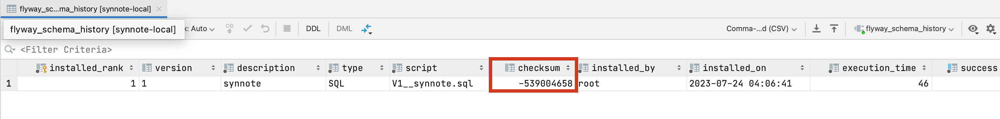

# Flyway 적용기

# 개요

> *Flyway is an open-source database migration tool.*
>

Flyway는 오픈소스 DB 마이그레이션 도구로, DB 형상 관리를 위한 도구이다.

Flyway를 적용하게 된 이유는 다음과 같다.

1. 버전 관리: 데이터베이스 스키마의 버전을 명확하게 관리하여 현재 데이터베이스의 상태를 알 수 있다. 또한 어떤 SQL 코드가 DB 변경에 영향을 주었는지 찾을 수 있다.
2. 일관성 유지: 모든 환경에서 동일한 순서로 동일한 마이그레이션을 진행한다. 따라서 로컬 환경이나 테스트 환경에서 데이터베이스의 스키마의 일관성을 유지할 수 있다.

# Flyway 적용 Rule

Flyway는 다양한 장점을 가지고 있지만 현실에서 별도 규칙 없이 적용하게 되면 마이그레이션 파일 순서가 꼬이거나 프로덕션 환경에서 문제가 생길 가능성이 있다.

그래서 우리팀은 Flyway 적용 규칙을 정해야 안전하고 쉽게 사용할 수 있다고 판단했다. (물론 이를 관리하는 팀원은 한명이지만 혹시 모르니 규칙을 미리 생성해둠..)

1. **프로덕션 환경에서는 Flyway를 적용하지 않고, 개발과 테스트 환경에서는 application이 구동될 때 application이 Flyway를 반영한다.**

   마이그레이션 파일에 DDL 문을 작성한다. 어떤 DDL 문은 데이터의 건수와 데이터베이스에 따라서 수십분에서 수시간이 걸린다. 물론 우리 서비스는 아직 데이터가 쌓이지 않아서 대부분의 DDL이 서비스 영향 없이 적용될 수 있다. 하지만 레코드가 천만에서 억 단위가 넘어가게 되면, 단순한 컬럼 하나 추가라도 수십분씩 시간이 걸릴 수도 있다. application이 구동될 때 application이 Flyway를 반영한다면, 서비스에 영향을 준다는 것이다.

   따라서 프로덕션에서는 Flyway 마이그레이션 기능을 비활성화하고 수동으로 DevOps Host EC2에서 수행하도록 한다.

    ```yaml
    spring:
    	flyway:
    		enabled: false
    ```

   대신, 수동으로 수행하는 DDL을 관리하기 위해서 별도의 팀 위키 페이지를 만들어서 해당 위키에 Flyway 마이그레이션 파일을 작성했는지, 반영했는지에 대한 정보를 관리한다.

2. **JPA Entity 클래스와 마이그레이션 파일은 동시에 작성한다.**

   Spring JPA 환경에서 Entity 클래스는 DB 테이블과 매핑한다. 즉 Entity 클래스의 속성 변경과 DB 테이블 변경 사항은 함께 동작해야한다. DB를 반영하는 Entity 클래스는 마이그레이션 파일과 함께 다루어져야 한다.

   이를 지키지 않는다면, 다음과 같은 문제가 발생할 수 있다.

    - DB 테이블 변경하지 않고, 속성이 변경된 Entity 클래스 사용
    - DB 테이블만 변경하고, 속성이 변경되지 않은 Entity 클래스 사용

   이를 예방하기 위해 다음과 같은 제약을 둔다.

    ```yaml
    spring:
    	jpa:
    		hibernate:
    			ddl-auto: validate
    ```

   ddl-auto: validate는 Entity 클래스와 DB 테이블이 정상적으로 매핑되는지만 검사한다. 만약 테이블이 아예 존재하지 않거나, 테이블에 엔티티의 필드에 매핑되는 컬럼이 존재하지 않으면 예외를 발생시키면서 애플리케이션을 종료한다.


1. **마이그레이션 파일명 규칙**

   이 규칙은 협업을 할 때 발생할 수 있는 문제를 예방하기 위해 미리 작성해둔 규칙이다.

   Flyway는 다양한 기능과 의미를 포함하도록 파일명 형식을 다양하게 지원하지만, 우리팀은 다음과 같은 제약으로 마이그레이션 파일명을 작성하도록 한다.

    ```sql
    V{순차적인 버전 번호}__synnote.sql
    ```

   {순차적인 버전 번호}는 정수형으로만 작성하고, 순차적으로 작성하도록 한다. synnote에 해당하는 부분은 애플리케이션 이름을 적도록 하는데, synnote로 고정한다.

   이와 같이 마이그레이션 파일명의 변경 가능한 값을 {순차적인 버전 번호}로 제약함으로써 협언 간의 마이그레이션 파일이 동시 작성되는 충돌을 방지할 수 있다.

2. **한 번 반영된 마이그레이션 파일의 내용은 바꾸지 않는다.**

   Flyway는 flyway_scheme_history 테이블을 통해 데이터를 관리함으로써 마이그레이션 파일의 변경사항을 감지한다. flyway_scheme_history 테이블을 보면, 아래 이미지와 같이 체크섬 코드값이 삽입되어 있는 것을 볼 수 있다.

  

   따라서 이미 마이그레이션 되었던 SQL 파일이 변경된다면, 체크섬 검증이 실패하고 마이그레이션이 수행되지 않는다. 그러므로 한 번 반영된 마이그레이션 파일의 내용은 바꾸지 않는다.

   컬럼을 다시 삭제하고 싶거나 오타가 발생한 상황이라도 반영된 DDL을 되돌리고 싶다면, 새로운 버전의 마이그레이션 파일을 만들어서 복구해야 한다.


## Flyway clean configuration code

```kotlin
@Configuration
class FlywayConfig {

    @Bean
    fun cleanMigrateStrategy(): FlywayMigrationStrategy {
        return FlywayMigrationStrategy { flyway: Flyway ->
            flyway.clean()
            flyway.migrate()
        }
    }
}
```
