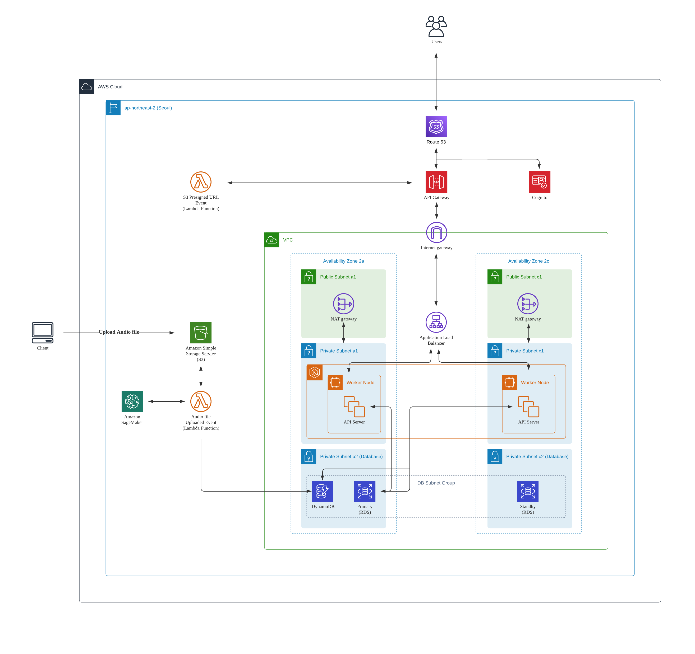
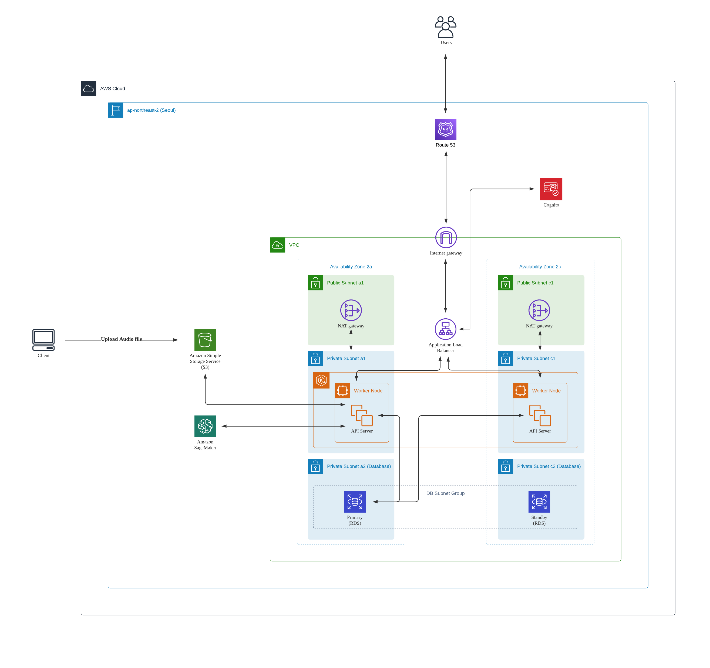
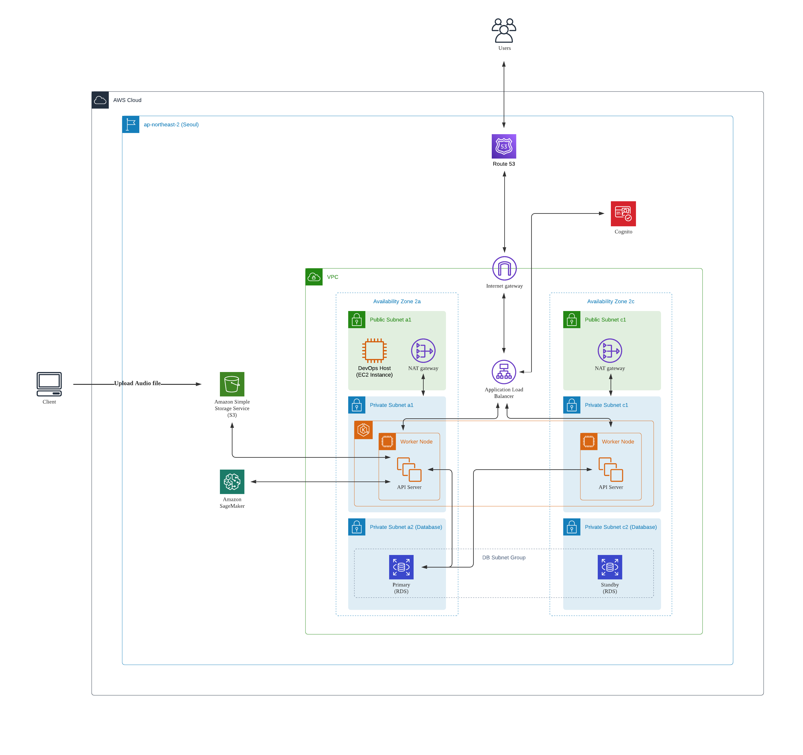
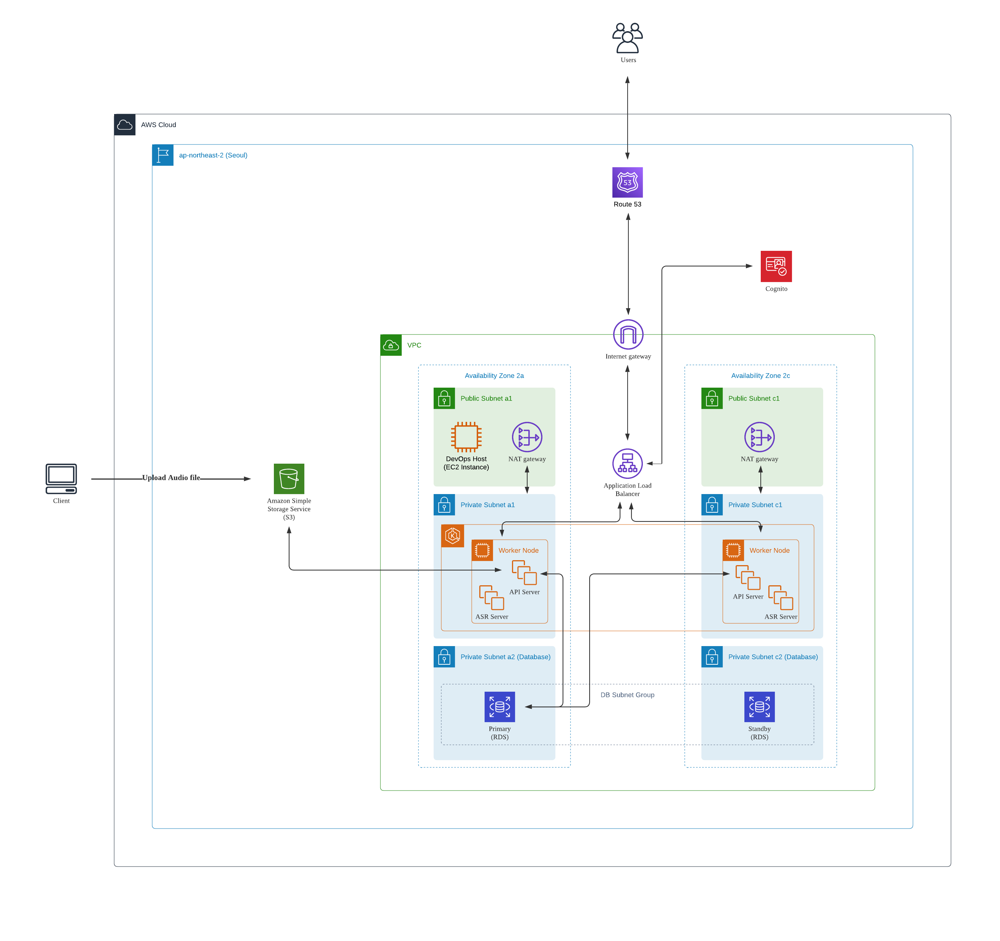
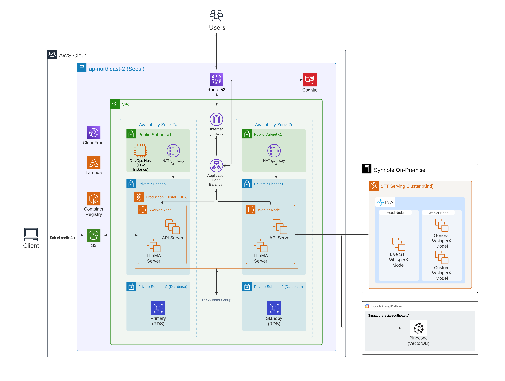

# AWS Architecture

<aside>
💡 AWS 기반의 클라우드 아키텍처 설계
시스템을 개발하면서 AWS Architecture를 버전 1.0에서 지속해서 발전시킬 예정

</aside>

# v1

2023/07/03

- VPC를 통해 Subnet 단위를 나누고, 전체 시스템은 3가지의 하위 레이어를 가짐
    - 퍼블릭 레이어: 외부와 직접 통신하는 레이어
    - 앱 레이어: API 통신을 위한 Synnote API 서버(EKS)
    - 데이터베이스 레이어: Synnote API가 처리하는 서비스의 일반적인 관계형 데이터 저장을 위한 데이터베이스(RDS)와 음성 전사본을 저장하는 키-값 데이터베이스(Dynamo DB)가 존재하는 레이어
- 고가용성을 보장하기 위해 AZ를 나누어 이중화 처리가 되어있는 설계
    - 앱 레이어: EKS 클러스터 노드를 AZ 2개에 분산
    - 데이터베이스 레이어: StandBy RDS를 다른 AZ에 분산하여 구성. Primary RDS가 문제가 발생했을 때 StandBy RDS가 자동으로 대체하여 서비스 중단을 최소화하도록 설계
- API 서버들의 컨테이너화 및 컨테이너 오케스트레이션에 중점을 두어 AWS EKS 기반으로 설계
- Cognito에게 전체 시스템의 인증과 사용자 관리를 수행하도록 위임
- 별도의 인증 과정 없이 파일을 업로드 혹은 다운로드 하는 것을 막기 위해, AWS S3에서 제공하는 Presigned URL을 AWS Lambda가 제공함으로써 파일 업로드/다운로드의 안전성 확보

# v2

2023/07/12

- AWS DynamoDB 구성을 AWS RDS(MySQL)로 재구성
    - 음성 전사본 대량의 데이터를 빠르게 저장하고 조회하기 위해 도입하였으나, [각 아이템의 문자열 최대 크기는 400KB](https://docs.aws.amazon.com/ko_kr/amazondynamodb/latest/developerguide/ServiceQuotas.html), 또한 조회하는 KB에 따른 과금 한계로 인해 RDB로 대체
    - DynamoDB는 음성 전사본 문자를 약 400,000개 저장할 수 있는데, 아이템의 최대 크기를 넘어설 수 있다고 생각함. 데이터를 분할해서 여러 아이템에 저장하는 것보다 AWS RDS(MySQL)에 메타데이터(사용자 정보, 전사 시간)를 함께 저장
- AWS S3 Presigned URL을 AWS Lambda 함수가 제공하는 구성을 백엔드가 제공하고 처리하는 것으로 재구성
    1. 음성 파일이 S3에 올라가면 STT를 트리거하고 메타 데이터(음성 전사 진행 상태)들을 데이터베이스에서 관리를 해주어야 하기 때문에 백엔드에서 일괄적으로 처리하는 것이 효율적이라 판단
    2. 애플리케이션을 서버리스와 EKS 기반으로 구성하는 것이 관리 측면에서 비효율적이라 판단
    - flow
        - 백엔드가 AWS S3 Presigned URL을 클라이언트에게 제공 → 클라이언트가 음성 파일을 S3에 업로드 → 업로드가 완료되면 클라이언트가 [업로드 완료 API] 호출

# v3

2023/07/24

- DevOps Host EC2 구축
    - 필요한 최소한의 권한을 부여하여 보안 강화
    - EKS 클러스터 노드 또는 RDS 인스턴스를 공용 인터넷에 직접 노출하지 않고, DevOps Host EC2를 통해서만 제한적으로 허용하도록 하여 일관된 접근 방법 제공

# v4

2023/08/05

- 훈련된 모델을 SageMaker로 호스팅 → EKS Pod로 배포
    - 기존 릴리즈 계획으로는 오픈소스 WhisperX 모델을 튜닝하여 훈련된 모델을 AWS SageMaker로 호스팅하고 배포할 예정이였음. WhisperX의 기능으로는 STT, 발화자 분리, 문장별 시작시간, 종료시간을 알아낼 수 있었음.
    - 하지만 AWS SageMaker의 높은 러닝커브로 인해 AI 팀원이 해당 서비스를 도입하는 데에 어려움을 느낌
    - AI 팀원을 대신하여 Backend 팀원(본인)이 OPEN AI Whisper API를 사용하는 웹서버 애플리케이션을 구축하고, 이를 Amazon EKS에서 돌아가는 Pod로 배포함.

# v5 (최종)

