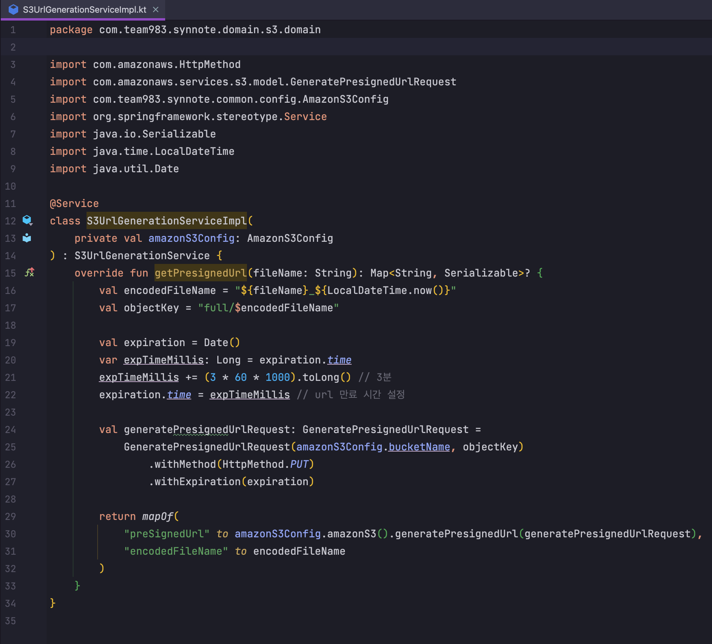
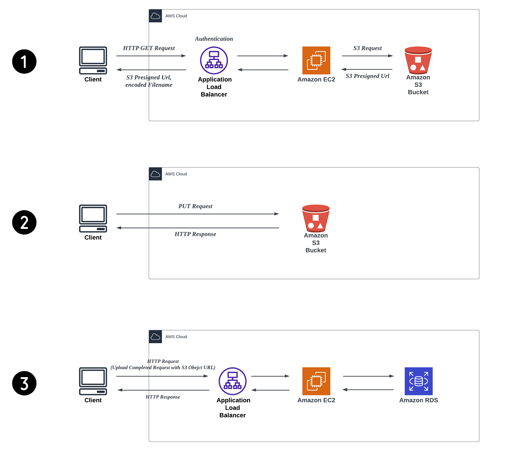

# AWS S3 Presigned URL 기반 녹음본 파일 업로드

# 개요

Synnote 서비스에서는 사용자가 녹음을 마치고 나면 해당 녹음본을 Speech To Text 해주는 요구사항이 존재한다. 서버에서 직접 녹음본 파일을 S3 bucket에 업로드 하는 방법이 있지만, AWS Presigned URL을 발급받는 과정을 거쳐 클라이언트에서 해당 URL을 통해 직접 S3 업로드할 수 있도록 하였다.

해당 방법을 채택한 이유는 다음과 같다.

1. 서버에서 파일을 직접 S3 bucket으로 업로드 하는 방법은 **서버 I/O 부하가 큰 비효율적인 작업**이다.
2. **보안 문제**. 별도의 인증과정 없이 파일을 업로드 하는 것을 막기 위해 S3 Presigned URL을 제공하여 파일 업로드의 안정성을 확보할 수 있다.
    1. 서버에서 파일을 업로드 하는 것이 아니라 클라이언트에서 S3 Presigned URL을 발급받고 업로드 하는 로직을 수행할 수 있지만, 보안상 굉장히 취약하다. S3 Presigned URL을 발급 받는 과정에서 S3에 대한 접근 인증 권한을 가진 credential을 탈취 당하게 된다면, 누구나 S3 bucket에 접근할 수 있기 때문이다.

# 구현

서버는 S3에 대한 접근 권한 인증 및 S3 Presigned URl을 발급 받아 클라이언트에 전달한다.

objectKey는 S3에 실제 저장될 경로이다.

# Recording(녹음본) Upload Flow

1. 클라이언트가 API 서버에게 녹음본 업로드 API를 요청하면, ALB가 먼저 Authentication 수행하고 API 서버는 S3 Presigned URL을 생성하여 encoded Filename과 함께 반환
2. 클라이언트는 녹음본 파일을 Put Request로 S3 Presigned URL에 업로드
3. 클라이언트는 녹음본 파일이 S3 bucket에 업로드가 완료되었음을 API 서버에 알림

# 레퍼런스

[Uploading to Amazon S3 directly from a web or mobile application | Amazon Web Services](https://aws.amazon.com/ko/blogs/compute/uploading-to-amazon-s3-directly-from-a-web-or-mobile-application/)

[Uploading Images to S3 from a React Single Page Application](https://medium.com/developing-koan/uploading-images-to-s3-from-a-react-single-page-application-45a4d24af09f)
