# 노트 전체 조회 페이징 성능 개선

# Incident and Impact

SW마에스트로에서 진행하는 팀 프로젝트 서비스 출시 전 부하 테스트를 수행하고 있다.

- Throughput(Requests per second: [#/sec](mean))
    - 초기 서비스 오픈인 것을 감안하여 예상
    - DAU = 15000명
    - 1명당 평균 접속 수 = 4회
    - 1일 평균 접속 수에 대한 최대 피크 때 배율 = 5배
    - 안전계수 = 3
    - 1일 평균 rps: 15000(명) * 4(회) / 86400(초) * 3(안전계수) =  2.08 rps (사용 시나리오/초)
    - 1일 최대 rps: 15000(명) * 4(회) / 86400(초) * 5(1일 평균 접속 수에 대한 최대 피크 때 배율) * 3(안전계수) = 10.5 rps (사용 시나리오/초)
- Latency(Time per request: [ms](mean))
    - 각 API의 응답 평균이 200ms를 넘지 않음
    - 복잡한 트랜잭션이 필요한 경우 2초 이내
    - KISSmetrics([https://www.linkedin.com/pulse/dont-miss-out-revenue-importance-load-testing-olga-burdukovskaya/](https://www.linkedin.com/pulse/dont-miss-out-revenue-importance-load-testing-olga-burdukovskaya/))는 고객의 47%가 2초 이내의 시간에 로딩이 되는 웹 페이지를 원하고 있으며, 40%는 로딩에 3초 이상 걸리는 페이지를 바로 떠난다고 설명함
- VUser
    - 요청수 : 7회
    - T(VU iteration) : 7 x 0.5s + 1s = 4.5s
    - 최대 VUser : 10.5 x 4.5 / 7 = 7
    - 최소 VUser : 2.08 x 4.5 / 7 = 2

이러한 목표값을 가지고 단계별 부하 테스트를 수행하며 참조계 성능 테스트를 수행하고 있었다. 노트 전체 조회 API에 해당하는 페이징 성능 테스트를 해보니 아래와 같은 결과값이 도출되었다.

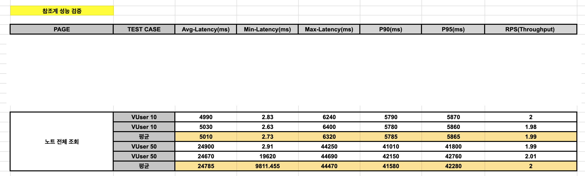

해당 노트 전체 조회 API 테스트는 가상 사용자 10명, 50명이 연속적으로 요청을 보내는 테스트이다. 결과를 분석해보자면, 서비스의 Throughput과 Latency 목푯값은 각각 10.5 rps 이상, 200ms 미만 이다. 물론 테스트의VUser(가상 사용자)는 10명, 50명이고 목푯값에 해당하는 최대 VUser는 7명이지만, 편차를 고려했을 때 목푯값에 한참 못미치는 수치이다.

사용자 시나리오 테스트를 수행할 때 노트 전체 조회가 사용자 시나리오에서 큰 비중을 차지하는 API인만큼 성능 개선이 필요함을 느꼈다.

# Root cause

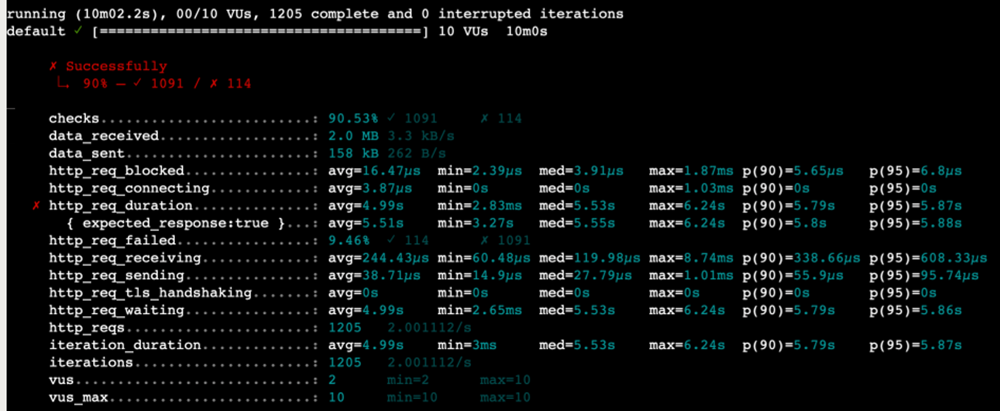

가상 사용자를 10명으로 설정하고 성능 테스트를 수행했을 때의 K6 테스트 결과 지표이다.

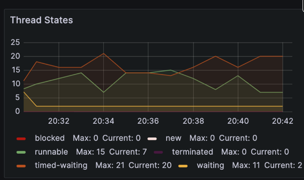

자바 애플리케이션의 메트릭을 수집하여 Thread States의 메트릭 수치를 보니 timed-waiting 값이 굉장히 높은 것을 확인할 수 있었다. 그래서 어느 곳에서 병목 현상이 발생하는지를 관찰하기 위해 Thread Dump 를 분석해보았다.

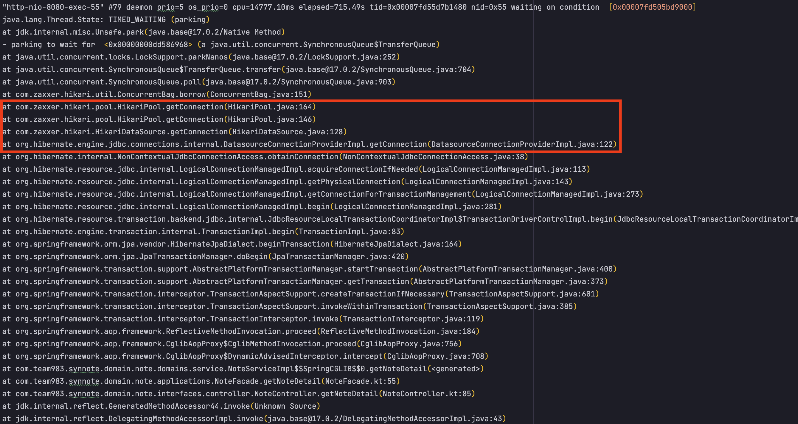

Thread Dump를 보면, 해당 스레드가 HikariCP에서 커넥션을 얻기 위해 대기 중인 것으로 보인다. 스레드가 TIMED_WAITING 상태에 있고, 스레드가 HikariCP의 커넥션 풀에서 데이터베이스 커넥션을 얻으려고 시도하고 있지만, 현재 사용 가능한 커넥션이 없어서 대기하고 있다는 것을 나타낸다.

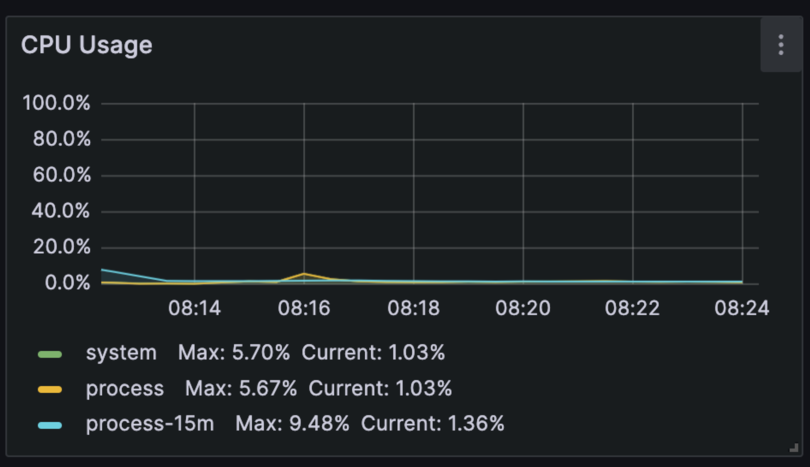

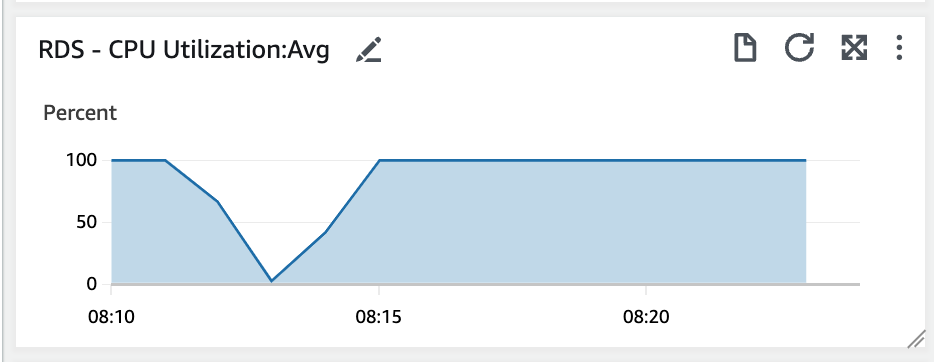

다음으로 JVM CPU 사용률과 RDS 서버 CPU 사용률을 확인해보았다. JVM CPU 사용률을 현저하게 낮은 반면에 RDS 서버의 사용률은 100%를 달성하여 과부하에 걸린 상태를 확인할 수 있었다.

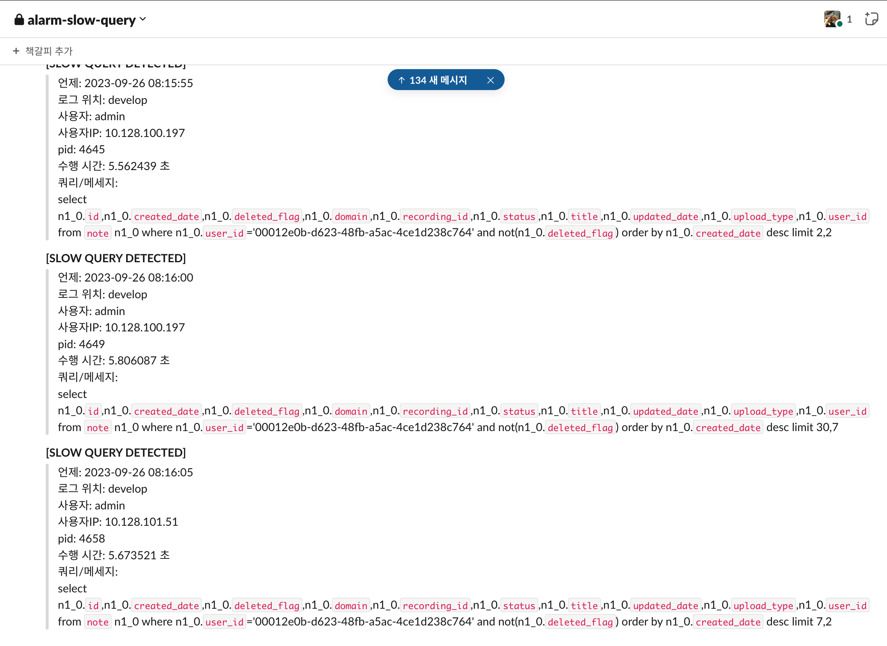

Slow Query를 감지하여 슬랙으로 웹훅을 보내주는 람다 함수를 만들고 테스트 중에 사용해보았더니 대부분 5초정도 걸리는 Query 들이 감지된 메세지들을 확인할 수 있었다. 이를 통해 쿼리 효율성의 문제라고 판단하였다.

# Recovery

결론부터 말하면, 아래와 같은 성능 개선을 이루었다.

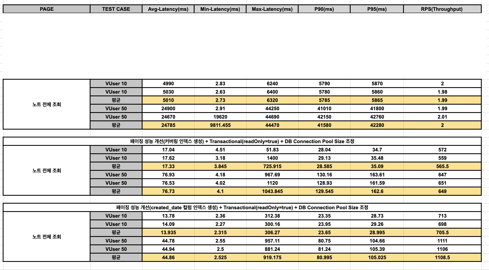

VUser 10일 때 Latency 5010 ms → 13.935 ms, Throughput 1.99 rps → 705.5 rps

VUser 50일 때 Latency 24785 ms → 44.86 ms, Throughput 2 rps → 1108.5 rps

## 인덱스 설정

노트 전체 조회를 수행할 때 발생하는 Slow Query의 실행계획을 확인해서 문제점을 파악해보았다.

```
[
  {
    "id": 1,
    "select_type": "SIMPLE",
    "table": "n",
    "partitions": null,
    "type": "ALL",
    "possible_keys": null,
    "key": null,
    "key_len": null,
    "ref": null,
    "rows": 3436477,
    "filtered": 1,
    "Extra": "Using where; Using filesort"
  }
]
```

“type”: “ALL”은 전체 테이블 스캔을 의미하는데, 이는 인덱스를 사용하지 않고 테이블의 모든 행을 검사한다는 것을 나타낸다. "possible_keys": null 및 "key": null은 사용 가능한 인덱스가 없다는 것을 나타낸다. 또한 Extra를 확인해보니 결과 행을 정렬하기 위해 디스크 기반의 파일 정렬(Using filesort)이 사용되었음을 알 수 잇었다.

### 커버링 인덱스 추가

커버링 인덱스는 쿼리를 충족하는데 필요한 모든 데이터를 갖는 인덱스를 뜻한다. SELECT / WHERE / GROUP BY / ORDER BY 등에 활용되는 모든 컬럼이 인덱스의 구성 요소인 경우를 말한다. 커버링 인덱스를 쓰면 조회 성능을 상당 부분 높일 수 있다고 하여 커버링 인덱스를 추가해보았다.

```
CREATE INDEX idx_covering_on_where_order_by ON note (user_id, deleted_flag, created_date desc);
```

```
select
  n.id,
  n.created_date,
  n.deleted_flag,
  n.domain,
  n.recording_id,
  n.status,
  n.title,
  n.updated_date,
  n.upload_type,
  n.user_id
from note n
join (select id
      from note
      WHERE
        user_id='003d26d0-39c7-452c-80b0-d9cf1b86083f'
      AND
        deleted_flag = 0
      ORDER BY
        created_date desc
      LIMIT 5,10) temp on n.id = temp.id;
```

```
[
  {
    "id": 1,
    "select_type": "PRIMARY",
    "table": "<derived2>",
    "partitions": null,
    "type": "ALL",
    "possible_keys": null,
    "key": null,
    "key_len": null,
    "ref": null,
    "rows": 15,
    "filtered": 100,
    "Extra": null
  },
  {
    "id": 1,
    "select_type": "PRIMARY",
    "table": "n",
    "partitions": null,
    "type": "eq_ref",
    "possible_keys": "PRIMARY",
    "key": "PRIMARY",
    "key_len": "8",
    "ref": "temp.id",
    "rows": 1,
    "filtered": 100,
    "Extra": null
  },
  {
    "id": 2,
    "select_type": "DERIVED",
    "table": "note",
    "partitions": null,
    "type": "ref",
    "possible_keys": "idx_covering_on_where_order_by",
    "key": "idx_covering_on_where_order_by",
    "key_len": "147",
    "ref": "const,const",
    "rows": 90,
    "filtered": 100,
    "Extra": "Using index"
  }
]
```

쿼리 실행 계획의 Extra를 보면 Using index로 커버링 인덱스가 잘 사용된 것을 확인할 수 있었다.

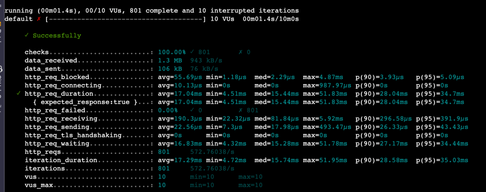

### 컬럼 인덱스 추가

```
CREATE INDEX idx_created_date_desc ON note (created_date desc);
```

```
select
  n.id,
  n.created_date,
  n.deleted_flag,
  n.domain,
  n.recording_id,
  n.status,
  n.title,
  n.updated_date,
  n.upload_type,
  n.user_id
from note n
WHERE
user_id='003d26d0-39c7-452c-80b0-d9cf1b86083f'
AND
deleted_flag = 0
ORDER BY
created_date desc
LIMIT 5,10;
```

```
[
  {
    "id": 1,
    "select_type": "SIMPLE",
    "table": "n",
    "partitions": null,
    "type": "index",
    "possible_keys": null,
    "key": "idx_created_date_desc",
    "key_len": "4",
    "ref": null,
    "rows": 15,
    "filtered": 1,
    "Extra": "Using where"
  }
]
```

ORDER BY 절인 created_date 컬럼에 인덱스를 추가하여 데이터가 정렬되도록 했다. created_date에 인덱스가 있으면, MySQL은 디스크에 저장된 행을 정렬된 순서대로 빠르게 접근할 수 있어, 정렬 작업이 훨씬 빠르고 효율적으로 이루어진다.이렇게 되면, LIMIT 절도 효율적으로 처리할 수 있게 된다.

인덱스를 건 후 실행계획을 확인해보니 idx_created_date_desc 인덱스를 사용하여 인덱스 스캔이 수행된 것을 확인할 수 있었다. 그리고 filesort가 제거되었고 훑는 row 수가 개선 전 쿼리에 비해 대폭 줄어들었다.

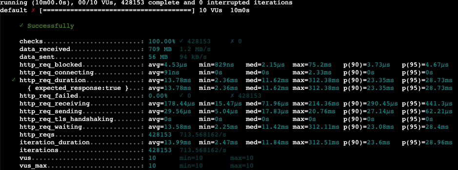

결국 created_data에 인덱스를 추가하여 쿼리 성능 개선을 하는 것으로 결정했다. 커버링 인덱스를 추가하게 되면, where절에 필요한 컬럼외에도 order by, group by, having 등에 들어가는 컬럼들까지 인덱스에 들어가게 되어 인덱스에 크기가 커질 것이라고 생각했다. 또한 추후 기능 개발을 하여 느린 쿼리가 발생할 때마다 인덱스가 신규로 생성될 가능성이 높을 것 같아 속도가 빠르고 저장 공간에서 우수한 컬럼 인덱스만 추가하였다.

## **WAS Tomcat Thread Pool 설정 &** DB Connection Pool 설정

현재 애플리케이션은 Springboot Embedded Tomcat으로 운영되고 있다. Embedded Tomcat의 경우 설정을 하지 않으면 활성화되는 최대 스레드의 갯수는 200개이다. Thread Dump를 분석함으로써 많은 스레드들이 waiting 상태로 머물고 있는 것을 확인하고 스레드 수를 줄여가며 확인해보았다.

그 다음으로 DB Connection Pool 설정이다. Springboot 공식 문서를 보니 spring.datasource.hikari.maximum-pool-size=10인 것을 확인하였다. 위에서 Thread Dump를 분석한 것과 같이 Connection Pool의 크기가 작으면 Connection을 획득하기 위해 대기하는 Thread가 많아지고, 이에 따라 성능적인 저하를 발생시킨 것을 알 수 있었다. 따라서 Connection Pool의 크기를 늘려주며 확인해보았다.

Connection Pool 크기를 늘리고 스레드 수를 줄여가며 테스트를 진행했고 아래와 같은 설정으로 했을 떄 가장 안정적으로 동작한다고 판단하였다.

```
server:
  tomcat:
    threads:
      max: 100
spring:
  datasource:
    hikari:
      maximum-pool-size: 20
```

## readOnly transaction 적용

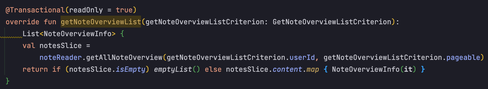

추가적으로 애플리케이션 코드를 리팩토링하였다. 노트 전체 조회 메소드에서 @Transactional 애노테이션은 불필요하게 작동되는 것을 확인하여, @Transactional(readOnly = true)를 사용하여 성능을 개선할 수 있었다.

readOnly = true를 설정하면 변경 감지, 세션 플러시, 원본 스냅샷 생성과 같은 기능이 비활성화 되는데, 이는 시스템의 부하를 줄여 성능을 개선할 수 있다.
