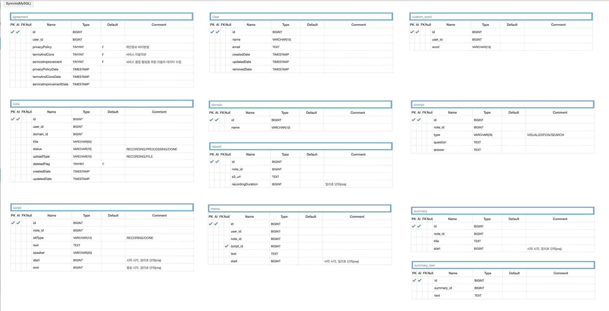

# 데이터베이스 모델링 및 리팩토링

# v1(2023/07/11)

# v2 (2023/07/20)

- agreement 테이블 추가
    - agreement 테이블: 사용자로부터 동의를 얻어야하는 개인정보 처리방침, 서비스 이용약관, 서비스 품질 향상을 위한 데이터 수집 정보를 담은 테이블
- BaseEntity 테이블 제거
    - 각 테이블 별로 createdDate, UpdatedDate 등 시간 데이터를 각각 다르게 포함하기 때문에 제거함
- start_time → start, end_time → end 컬럼명 변경
- start, end 컬럼 밀리초 단위(ms)로 단위 변경
- record 테이블 length → recordingDuration 컬럼명 변경
- note 테이블 deleteFlag 컬럼 추가
    - note 삭제 요구사항 추가에 따른 컬럼 추가
- note title 수정, script 수정, memo 수정, summary 수정 요구사항은 추후 반영 예정

# v3 (2023/07/27)

- user 테이블 id Column Type 변경: BIGINT → VARCHAR(36), Auto Increment 해제
    - ALB와 Cognito을 통합하여 사용자 인증을 처리하는데, Cognito에서 발급하는 JWT의 ‘sub’ 클레임은 Cognito User Pool 내에서 해당 사용자를 고유하게 식별하는 UUID임
    - ‘sub’ 값을 User 테이블의 PK 값으로 사용하는 것으로 결정
    - ‘sub’ 값은 Cognito에서 관리되고, 사용자 관리의 복잡성을 줄일 수 있다고 판단됨
    - 하지만, 여러 소셜 로그인 서비스를 사용한다면 이 ‘sub’ 값이 모든 서비스에서 일관되게 사용되어야 하는 고려사항이 있지만, Synnote는 구글 소셜 로그인만 지원하기 때문에 Congito와 애플리케이션의 사용자 아이덴티티를 일치시키는 것으로 결정

# v4 (2023/08/05)

- domain 테이블 제거 → note 테이블에 domain 컬럼을 둠
    - domain 테이블을 별도로 만드는 것은 데이터 정규화나 domain에 대한 메타 데이터를 함께 저장하는 경우에 도움이 됨
    - 하지만 Synnote 서비스는 domain 값이 바뀔 가능성은 0에 수렴하고 값을 추가하는 경우만 존재함.
      또한 각 노트에 대해 domain이 고정된 값을 가지고, 노트를 조회할 때마다 domain을 가져와야 하기 때문에 조인 연산이 아닌 단순한 쿼리로 가져오는 경우가 더 유용함. 따라서 note 테이블에 domain 컬럼을 두는 것으로 변경함.
- agreement 테이블에 user_id 컬럼 → user 테이블에 agreement_id 컬럼으로 변경
    - user와 agreement는 1:1 관계를 가짐. user가 agreement보다 상위 개념으로, user가 없으면 agreement가 존재할 이유가 없음.
    - Spring Data JPA 관점에서 주 테이블인 user 테이블에 외래키를 둠으로써 주 테이블만 조회해도 대상 테이블인 agreement 테이블의 데이터를 확인할 수 있음.
- recording 테이블에 note_id 컬럼 → note 테이블에 recording_id 컬럼으로 변경
    - 위와 동일한 이유로 변경
- script 테이블의 speaker, start, end 컬럼 NULL 가능으로 변경
    - 기존 계획으로는 오픈소스 WhisperX 모델을 튜닝하여 훈련된 모델을 AWS SageMaker로 호스팅하고 배포할 예정이였음. WhisperX의 기능으로는 STT, 발화자 분리, 문장별 시작시간, 종료시간을 알아낼 수 있었음.
    - 하지만 AI 팀원이 AWS SageMaker의 높은 러닝커브로 인해 도입 실패
    - AI 팀원을 대신하여 Backend 팀원(본인)이 OPEAN AI Whisper API를 사용하는 웹서버 애플리케이션을 구축하고, 이를 Amazon EKS에서 돌아가는 파드로 배포함. Whisper API는 발화자분리, 문장별 시작시간, 종료시간을 알아낼 수 없기 때문에 해당 컬럼을 NULL 가능으로 변경함

# v5 (2023/10/10)

- memo 테이블 user_id 컬럼, end 컬럼 제거
    - memo는 note에 속하며, note는 특정 user에 속함. 따라서 사용자를 통해 note를 조회하면 해당 note에 속한 모든 memo를 알 수 있는데, memo에 직접 user_id를 저장하는 것은 불필요한 중복성을 가지기 때문에 user_id 컬럼 제거
    - Live STT 기능은 채팅창 형식으로 사용자에게 제공됨. 전사된 내용과 사용자가 입력한 메모가 시간순의 역순으로 보여지는데, 이는 각각 start 컬럼으로 정렬함. 따라서 memo의 end 컬럼을 존재할 이유가 없고 사용자가 메모를 작성한 시각만 저장하는 start 컬럼만 유지
- note 테이블 language 컬럼 추가
    - WhisperX 모델은 요청받은 녹음본이 어떤 언어로 구성되어 있는지에 대한 정보도 전사본과 같이 제공함.
    - 따라서 해당 note가 어떤 언어로 구성되어 있는지에 대한 정보를 저장하기 위한 컬럼 추가
- prompt 테이블 제거
    - 텍스트 시각화 기능에서 사용자가 입력한 prompt를 저장하는 테이블이였지만, 텍스트 시각화 요청 방법 변경으로 인한 테이블 제거

# v6 (최종)

