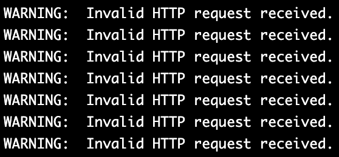
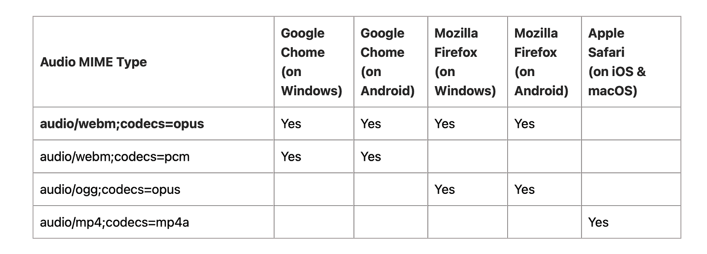
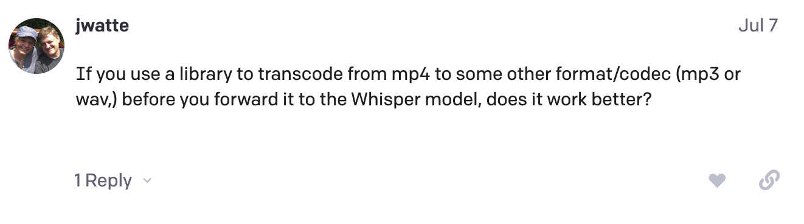
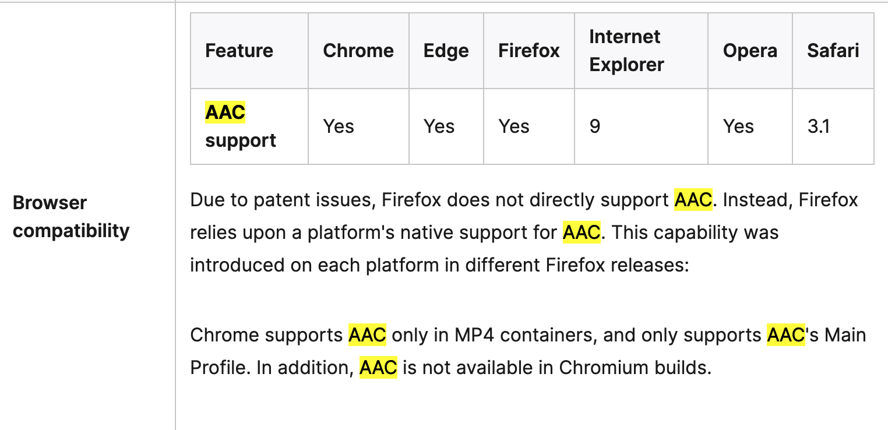

# 2023/10/04: 음성 파일 업로드 방식으로 전사할 때 파일 확장자 문제로 전사가 실패하는 문제

# Incident and impact

2023년 10월 4일 19:11 부터 API 서버로부터 400 HTTP Status Code가 발생하는 문제가 발생했다.

API 서버의 메트릭을 수집하여 모니터링하는 Grafana에서 HTTP Success Rate 대시보드를 보니, `/api/vi/note/recorind-end` API의 성공률이 34.7% 로 떨어진 것을 확인하였다.

# Root cause

Infra 리소스를 확인해보니 문제가 없었다.

전사를 담당하고 있는 ASR 서버의 로그를 확인해보았다.



```json
INFO:openai:error_code=None error_message="Invalid file format. Supported formats: ['flac', 'm4a', 'mp3', 'mp4', 'mpeg', 'mpga', 'oga', 'ogg', 'wav', 'webm']" error_param=None error_type=invalid_request_error message='OpenAI API error received' stream_error=False
ERROR:services.stt_service:Error processing 1333 2023-10-02T10:56:01.858055558_(1333).webm. Error: Invalid file format. Supported formats: ['flac', 'm4a', 'mp3', 'mp4', 'mpeg', 'mpga', 'oga', 'ogg', 'wav', 'webm']
```

OpenAI Whisper API는 현재 `'flac', 'm4a', 'mp3', 'mp4', 'mpeg', 'mpga', 'oga', 'ogg', 'wav', 'webm'` 의 확장자를 가진 오디오 파일만 전사를 수행하고 있다.

따라서 우선 전사를 실패한 오디오 파일을 직접 확인해보았다. 확인해보니 파일 업로드로 전사 요청을 한 파일은  Whisper API가 수행 가능한 확장자 형식인 mp4를 가지고 있었다.

[Whisper api completely wrong for mp4](https://community.openai.com/t/whisper-api-completely-wrong-for-mp4/289256/7)

OpenAI Whisper Community를 확인해보니 mp4 확장자를 가진 오디오 파일은 a compression standard, like a zip file 이고, audio codec이 아니기 때문에 STT를 수행하지 못하는 문제였다.

현재 Synnote 서비스는 웹과 모바일 모두에서 사용할 수 있다. 그리고 전사를 요청(노트 생성)할 수 있는 방법은 총 두 가지이다. 녹음과 음성 오디오 파일 업로드.



위 표는 다양한 Audio MIME Type이 주요 웹브라우저와 운영체제에서 어떻게 지원되는지 나타내는 표이다.

녹음 수행하는 웹브라우저와 운영체제는 각각 다른 Audio MIME Type으로 음성 오디오 파일이 생성된다. 문제 발생 전에는 각각 다른 Audio MIME Type 그대로의 음성 오디오 파일이 S3에 저장되고 그대로 Whisper API를 통해 전사를 요청했다.

또한 음성 오디오 파일 업로드 같은 경우에도 마찬가지로 사용자가 올린 각각 다른 Audio MIME Type 그대로의 음성 오디오 파일이 S3에 저장되고 그대로 Whisper API를 통해 전사를 요청했다.

추가적으로 통일성이 없는 문제가 발생한 것이다.

# Recovery



위 OpenAI Whisper Community의 답변을 참고해서 전사 요청을 보내기 전에 각각 다른 Audio MIME Type의 음성 오디오 파일을 하나로 통일시켰다.

[Web audio codec guide - Web media technologies | MDN](https://developer.mozilla.org/en-US/docs/Web/Media/Formats/Audio_codecs)



**Web audio codec guide를 참고하여 AAC Codec을 가지도록 ffmpeg 이라는 라이브러리를 사용해서 음성 오디오 파일을 변환하는 작업**을 추가하였다.

[https://github.com/Team983/asr-server/commit/62627113bd07ace2d15b2644c77483d6afd3cb8d](https://github.com/Team983/asr-server/commit/62627113bd07ace2d15b2644c77483d6afd3cb8d)

[https://github.com/Team983/synnote-server/commit/48f44b1ec7c27f9b1334547b90c01836f95fb563](https://github.com/Team983/synnote-server/commit/48f44b1ec7c27f9b1334547b90c01836f95fb563)

위 작업을 배포하여  2023년 10월 5일 23시 50분 경 음성 오디오 파일 업로드 방식으로 전사할 때 발생하는 문제를 모두 해결하였다.

# Lessons learned

- 각 웹브라우저 및 운영체제 별로 Audio를 처리하는 방식이 다르다는 것을 처음 알았다.
- 서비스 장애가 났을 때 대응하는 정책의 필요성을 느꼈다.
- 또한 서비스의 동작 상태 표시 및 장애 원인 파악을 위하여 로깅 작업의 필요성을 느꼈다.
